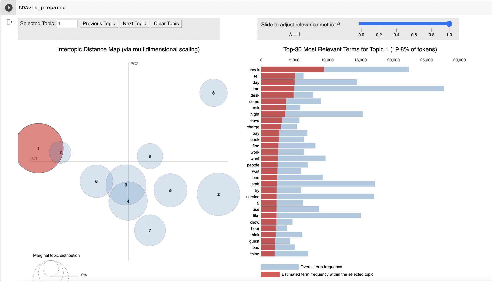

# Yelp-Reviews-Topic-Modeling
This is a NLP project where I learned the basics of LDA and applying LDA for Topic Modeling

[Dataset](https://drive.google.com/drive/folders/1nUIOHqvOoF5EkST8u_pMcL7gvKtCy0La?usp=sharing)

Learnings - 
* Concept and application of Latent Dirichlet Allocation
* Application of Sentimental Analysis on Topic Modeling to review the positive and negative reviews
* Evaluation metrics of Topic Modeling
* Exploratory Data Analysis 

Major Outcomes - 
* "Review Rating" provided by the user didn't correlate well with the sentiment analysis of the reviews
* Classifying the reviews based on specific topics
* Sentimental Analysis on Topic Modeling shows that the positive reviews speak more about how beautiful the places are and the experience in Las Vegas and the negative reviews speak generally about customer service at these resorts
